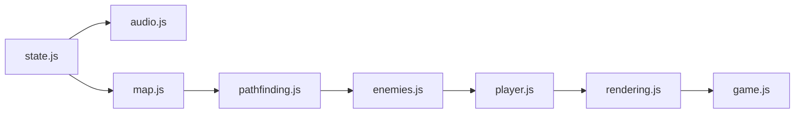
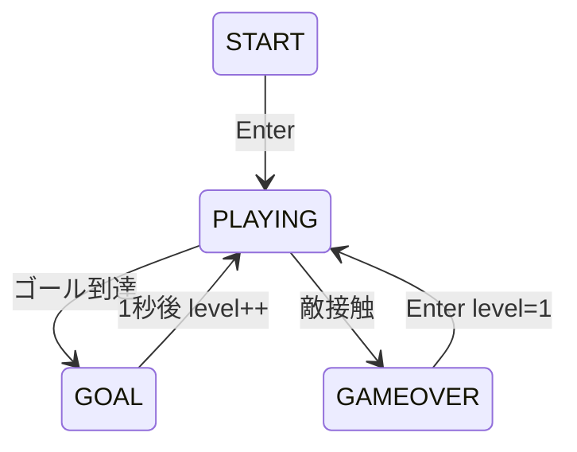
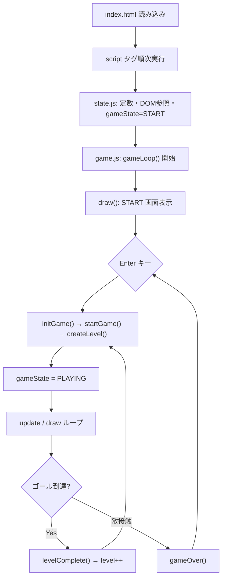
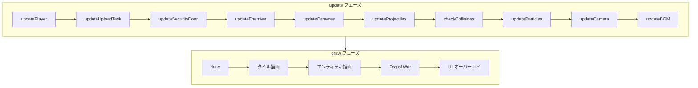

# 02 アーキテクチャ設計書

## 1. 全体構成

Stealth_Action は **グローバル状態 + 関数ベースモジュール分割** のアーキテクチャを採用する。クラスや ES Modules は使用せず、`index.html` の `<script>` タグ読み込み順で依存関係を定義する。

---

## 2. モジュール依存関係

[`index.html`](../index.html) におけるスクリプト読み込み順:



| 順序 | ファイル | 役割 |
|---|---|---|
| 1 | `state.js` | 定数・グローバル変数・DOM 参照の定義 |
| 2 | `audio.js` | 音声初期化・再生（`gameState` を参照） |
| 3 | `map.js` | マップ生成・地形判定（`state.js` の定数・変数を使用） |
| 4 | `pathfinding.js` | A* 探索（`map.js` の `isTileBlockedForEnemy` を使用） |
| 5 | `enemies.js` | 敵・カメラ AI（`pathfinding.js`, `map.js` を使用） |
| 6 | `player.js` | プレイヤー操作（`map.js` の `moveEntity` を使用） |
| 7 | `rendering.js` | 描画（全エンティティ状態を参照） |
| 8 | `game.js` | メインループ・入力・衝突（全モジュールを統合） |

---

## 3. 主要アーキテクチャパターン

### 3.1 グローバル状態パターン

[`js/state.js`](../js/state.js) がゲーム全体の共有状態を保持する。各モジュールはトップレベル関数として実装され、グローバル変数を直接読み書きする。

**主要グローバル変数:**

| 変数 | 型 | 説明 |
|---|---|---|
| `gameState` | string | `"START"` / `"PLAYING"` / `"GOAL"` / `"GAMEOVER"` |
| `level` | number | 現在レベル |
| `map` | number[][] | 2次元タイル配列 |
| `player` | object | プレイヤー状態 |
| `enemies` | object[] | 敵配列 |
| `cameras` | object[] | 監視カメラ配列 |
| `items` | object[] | マップ上アイテム |
| `projectiles` | object[] | スタンガン弾 |
| `particles` | object[] | パーティクル |

### 3.2 Game Loop パターン

[`js/game.js`](../js/game.js) の `gameLoop()` が `requestAnimationFrame` で自身を再帰呼び出しする。

```
gameLoop()
  ├── update()   … ロジック更新（gameState === "PLAYING" 時のみ）
  └── draw()     … Canvas 描画（rendering.js）
```

ページ読み込み完了時、ファイル末尾の `gameLoop()` 呼び出しでループが開始される。

### 3.3 有限状態機械（FSM）

**ゲーム全体:**



**敵 AI:** PATROL → CHASE → ALERT → PATROL（詳細は [05-algorithms.md](./05-algorithms.md)）

**監視カメラ:** ACTIVE ↔ DISABLED

---

## 4. 起動フロー



### 4.1 主要初期化関数

| 関数 | ファイル | 処理 |
|---|---|---|
| `initGame()` | game.js | オーディオ初期化、level=1、startGame 呼び出し |
| `startGame()` | game.js | createLevel、gameState=PLAYING、HUD 更新 |
| `createLevel()` | map.js | マップ生成、敵・アイテム配置、プレイヤー初期化 |

---

## 5. 1フレームのデータフロー

### 5.1 update() 呼び出し順

[`js/game.js`](../js/game.js) の `update()` は `gameState === "PLAYING"` 時に以下を順次実行する:

```
updatePlayer()
  → updateUploadTask()
  → updateSecurityDoor()
  → updateEnemies()
  → updateCameras()
  → updateProjectiles()
  → checkCollisions()
  → updateParticles()
  → updateCamera()
  → updateBGM()
```



### 5.2 入力イベント

| イベント | ハンドラ位置 | 処理 |
|---|---|---|
| keydown / keyup | game.js | 移動キー、Enter、Space、Q、1-4 |
| mousemove | game.js | 照準角度更新 |
| mousedown | game.js | スタンガン発射 |
| wheel | game.js | アイテムスロット切替 |
| input (volume) | game.js | 音量変更 → `setVolume()` |

---

## 6. 描画アーキテクチャ

[`js/rendering.js`](../js/rendering.js) の `draw()` が全描画を担当する。

### 6.1 カメラオフセット

プレイヤー追従カメラ（`updateCamera()`）により、ワールド座標をスクリーン座標に変換する:

```javascript
ctx.translate(-camera.x, -camera.y);
```

マップ端ではカメラ位置をクランプし、画面外を表示しない。

### 6.2 描画レイヤー（奥 → 手前）

1. 背景（テーマ色）
2. タイル（床・壁・ドア）
3. ゴール・アップロード端末
4. アイテム
5. 監視カメラ（視界扇形含む）
6. 敵（視界扇形含む）
7. 弾丸
8. ナビ矢印（45秒経過後）
9. パーティクル
10. Fog of War（プレイヤー周囲の円形マスク）
11. プレイヤー効果 UI
12. 画面固定 UI（照準、START/GAMEOVER/GOAL 画面）

### 6.3 ビューポートカリング

タイル描画は `camera.x/y` から算出した表示範囲（startCol/endCol/startRow/endRow）のみ処理する。

---

## 7. 音声アーキテクチャ

[`js/audio.js`](../js/audio.js):

- **SE:** `playSE(type)` — 都度 Oscillator を生成して再生
- **BGM:** `updateBGM()` — 毎フレーム `scheduleNote()` でノートをスケジュール
- **追跡連動:** `updateEnemies()` が `bgmState.isChase` を更新し、追跡時はテンポアップ

---

## 8. 拡張時の影響範囲

| 変更内容 | 主な影響ファイル |
|---|---|
| 新アイテム追加 | state.js, player.js, rendering.js, game.js |
| 新レイアウト追加 | map.js |
| 新敵タイプ | enemies.js, rendering.js |
| 新テーマ追加 | state.js, rendering.js |
| UI 変更 | index.html, css/, player.js (updateHUD) |

---

## 9. 関連ドキュメント

- [04-module-design.md](./04-module-design.md) — 各モジュールの関数一覧
- [05-algorithms.md](./05-algorithms.md) — マップ生成・AI の詳細
