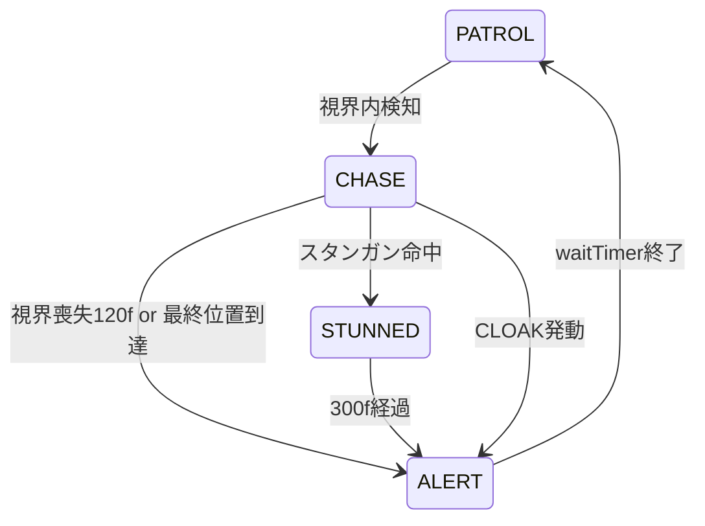

# 05 アルゴリズム設計書

マップ生成、経路探索、敵 AI、監視カメラのアルゴリズムを定義する。実装は [`js/map.js`](../js/map.js)、[`js/pathfinding.js`](../js/pathfinding.js)、[`js/enemies.js`](../js/enemies.js) を参照。

---

## 1. レイアウト選択

### 1.1 chooseLayoutType()

重み付きランダムで4種のレイアウトから1つを選択する。

| レイアウト | 基本重み | 出現条件 |
|---|---|---|
| `cave` | 2 | 常時 |
| `maze` | 2（奇数レベルは +1） | 常時 |
| `security` | `1 + (level - 6) * 1.2` | level >= 6 |
| `upload` | `0.8 + (level - 6) * 1.1` | level >= 6 |

```javascript
// 重み合計に対する乱数で選択
let r = Math.random() * total;
for (const w of weights) {
    if (r < w.weight) return w.type;
    r -= w.weight;
}
```

---

## 2. マップ生成アルゴリズム

### 2.1 cave（洞窟）

**手法:** ランダムウォーク

1. マップ中央から開始
2. 最大 `(COLS * ROWS) * 0.6` ステップ繰り返す
3. 各ステップ: 現在地を FLOOR にし、4方向からランダムに1歩移動
4. 境界は `x: 1..COLS-2`, `y: 1..ROWS-2` にクランプ

**出力:** `floorTiles[]` — 通行可能タイルの `{x, y}` 配列

### 2.2 maze（迷路）

**手法:** DFS 迷路生成 + 部屋追加 + ループ追加

1. **DFS 迷路:** 2セル単位のグリッド上で深さ優先探索。壁を掘り進め FLOOR タイルを生成
2. **部屋追加:** `(COLS*ROWS)/80 + random(0..3)` 個の矩形部屋（3-5 タイル幅）をランダム配置
3. **ループ追加:** `(COLS*ROWS)/20` 回、ランダムな WALL タイルを FLOOR に変換

### 2.3 security（二施設）

**手法:** 左右2エリア + 中央コリドー + セキュリティドア

```
┌─────────────┬──┬─────────────┐
│  Left Area  │D │ Right Area  │
│ (player)    │O │  (goal)     │
│ (keycard)   │O │             │
│             │R │             │
└─────────────┴──┴─────────────┘
```

1. 左エリアと右エリアを `carveMiniArea()` で生成（各 wing 幅 = `max(8, floor((COLS - 4 - 4) / 2))`）
2. 中央水平コリドー（`corridorY = ROWS/2`）で接続
3. コリドー中央に `TILE_DOOR` + `securityDoor` を配置
4. 左エリア: プレイヤー開始位置、キーカード配置
5. 右エリア: ゴール配置

**carveMiniArea():** エリア内をランダムウォークで床化し、コリドー Y 座標への接続通路を確保

### 2.4 upload（金庫）

**手法:** maze ベース + ゴール金庫 + アップロード端末

1. `createMazeLayout()` でベースマップ生成
2. `carveGoalVault()` — ゴール地点周辺を金庫状に拡張、金庫ドア（`uploadDoor`）配置
3. `pickUploadTerminalTile()` — ゴール・開始地点から十分離れた位置に端末配置

**金庫ドア解錠条件:** `uploadStatus.complete === true` の時点で自動解錠（距離判定なし）。未完了で近接した場合は "UPLOAD REQUIRED" 通知のみ

---

## 3. 接続性検証

### 3.1 validateConnectivity()

**目的:** プレイヤー開始地点からゴール（および必須地点）へ到達可能か、かつマップ全体が連結かを検証

**アルゴリズム:** BFS

1. 開始タイルから4方向 BFS
2. `isPassable`: `map[y][x] !== TILE_WALL`（ドアは通行可能）
3. 必須タイル（ゴール、アップロード端末、各ドア）がすべて visited に含まれるか確認
4. `visitedCount === passableCount` — 孤立床タイルがないか確認

**リトライ:** 検証失敗時、`createLevel(attempt + 1)` を最大 **6回** まで再帰呼び出し

---

## 4. 敵・カメラ配置

### 4.1 難易度予算

```javascript
totalDifficultyBudget = 30 + (level * 18)
```

| 要素 | コスト | 上限 |
|---|---|---|
| 監視カメラ | 10 | 予算の 40% まで |
| 敵 | `waypoints.length * 3 + pathLength/TILE_SIZE` | 予算合計まで |

**カメラ最大数:** `2 + (level - 1)`

### 4.2 敵配置条件

ランダムな floor タイルに対し、以下をすべて満たす場合に配置:

- プレイヤーから 300px 以上離れている
- 既存敵から 400px 以上離れている
- アップロード端末・ゴール近傍（upload レイアウト時）でない
- 重要ドアから 120px 以上離れている

### 4.3 監視カメラ配置

1. 50回ランダム試行
2. 壁に隣接する floor タイルを候補とする
3. 壁方向に向けて `baseAngle` を設定
4. プレイヤー・ゴールから 200px 以上、重要ドアから 100px 以上離れる（`TILE_SIZE * 2.5`）

---

## 5. A* 経路探索

### 5.1 findPath()

**用途:** 敵が CHASE 状態で壁越えにプレイヤー（最終目撃位置）へ向かう際

| 項目 | 値 |
|---|---|
| 移動方向 | 4方向（上下左右） |
| ヒューリスティック | Manhattan 距離 |
| コスト | 各ステップ 1 |
| 打ち切り | MAX_LOOPS = 500 |

**特殊処理:**
- 終点が壁の場合、4近傍の通行可能タイルを代替終点とする
- 経路が見つからない場合 `null` を返し、フォールバック（直線移動）に委ねる

### 5.2 敵による利用

- `pathTimer = 30` フレームごとにパス再計算
- 次ノードまで距離 < 5px で `path.shift()`
- 直線可視（`!lineIntersectsWall`）の場合は A* を使わず直接移動

---

## 6. 敵 AI

### 6.1 巡回ルート生成（createSmartEnemy）

1. 開始点から `findLongestPath()` — 4方向の直線最長点 p1
2. p1 から `findTurnPath()` — 前方向以外の最長点 p2
3. p2 から p1 以外方向の最長点 p3（開始点から 3 タイル以上離れていれば追加）
4. 巡回距離 < 4 タイルなら配置拒否（`null` 返却）

### 6.2 状態遷移



### 6.3 各状態の挙動

| 状態 | 挙動 |
|---|---|
| **PATROL** | waypoints を順番に巡回。到着時 waitTimer=40 |
| **CHASE** | 最終目撃位置 (targetX/Y) へ移動。速度 1.5倍。視界内なら target 更新 |
| **ALERT** | 停止して旋回（angle += 0.1）。waitTimer=90 後、最寄り waypoint へ PATROL 復帰 |
| **STUNNED** | 停止。waitTimer=300 後 ALERT へ |

### 6.4 視界判定（canSeePlayer）

```
1. CLOAK 発動中 → false
2. STUNNED → false
3. 距離 > viewDistance(160) → false
4. 角度差 > viewAngle(π/4) → false
5. lineIntersectsWall → false
6. それ以外 → true
```

**遮蔽判定:** 始点から終点まで `TILE_SIZE/4` 刻みで `isWall()` をサンプリング

---

## 7. 監視カメラ AI

### 7.1 スイング監視

```javascript
cam.phase += cam.swingSpeed;
cam.currentAngle = cam.baseAngle + Math.sin(cam.phase) * cam.swingRange;
```

- `swingSpeed`: `(0.01 + random*0.01) * 0.7`
- `swingRange`: π/3

### 7.2 検知処理（updateCameras）

1. DISABLED 時: `disableTimer` カウントダウン、0 で ACTIVE 復帰
2. CLOAK 発動中は検知しない
3. `canCameraSeePlayer()` が true の場合:
   - 最寄りの非 STUNNED 敵を CHASE 化
   - targetX/Y をプレイヤー位置に設定
   - 初回検知時: SE "camera_detect"、通知 "SECURITY ALERT!"

### 7.3 カメラ視界判定

| 条件 | 値 |
|---|---|
| 最大距離 | 130 px |
| 死角半径 | 40 px（この距離以内は検知不可） |
| 視界角度 | π/6 |
| 遮蔽 | lineIntersectsWall |

---

## 8. 視線遮蔽（lineIntersectsWall）

壁とドア（施錠中）を遮蔽物として扱う。

```javascript
const steps = dist(x1, y1, x2, y2) / (TILE_SIZE / 4);
// steps 回、線分上を等間隔サンプリング
for (let i = 0; i < steps; i++) {
    if (isWall(x1 + dx * i, y1 + dy * i)) return true;
}
```

敵視界、カメラ視界、敵の直線移動可否判定に共通利用。

---

## 9. アップロード進行

[`js/game.js`](../js/game.js) `updateUploadTask()`:

| 条件 | 処理 |
|---|---|
| 端末エリア内 | progress += 1 / frame |
| 端末エリア外 | progress -= 2 / frame（0 まで） |
| progress >= UPLOAD_REQUIRED_TIME | complete = true、SE "goal" |
| complete 後 | タイプライター表示、金庫ドア解錠可能に |

---

## 10. 関連ドキュメント

- [03-game-specification.md](./03-game-specification.md) — ゲームルール・アイテム仕様
- [04-module-design.md](./04-module-design.md) — 関数・データ構造一覧
